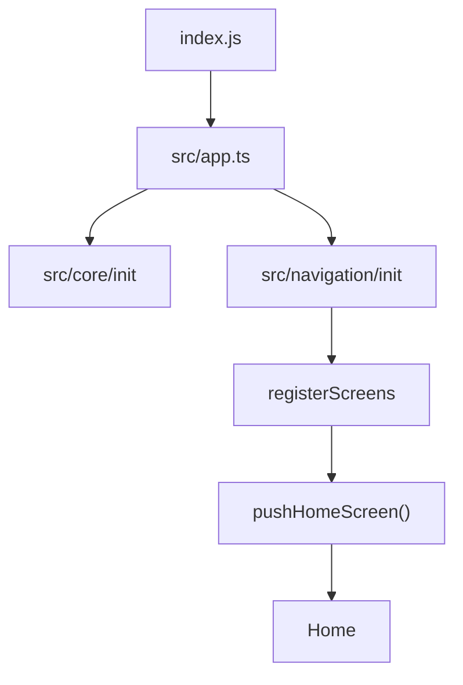

# 页面层级说明

本文基于当前仓库代码整理，重点说明应用的页面入口、导航关系，以及 `Home` 页面内部层级。

## 1. 启动链路

应用启动主链路如下：

1. `index.js`
2. `src/app.ts`
3. 执行基础初始化
   - 日志
   - 字体大小
   - 窗口尺寸
   - `src/core/init`
4. 初始化导航 `src/navigation`
5. 注册页面 `src/navigation/registerScreens.tsx`
6. 设置根页面为 `HomeScreen`

可以理解为：



## 2. 已注册页面

当前通过 `react-native-navigation` 注册的页面如下：

| 页面名 | Screen Name | 作用 |
| --- | --- | --- |
| Home | `lxm.HomeScreen` | 应用根页面 |
| PlayDetail | `lxm.PlayDetailScreen` | 播放详情页 |
| SonglistDetail | `lxm.SonglistDetailScreen` | 在线歌单详情页 |
| Comment | `lxm.CommentScreen` | 评论页 |
| LeaderboardDetail | `lxm.LeaderboardDetailScreen` | 排行榜详情页 |
| VersionModal | `lxm.VersionModal` | 版本更新弹窗 |
| PactModal | `lxm.PactModal` | 协议弹窗 |
| SyncModeModal | `lxm.SyncModeModal` | 同步模式弹窗 |

## 3. 页面导航关系

当前主导航关系如下：

```text
App
└─ Home
   ├─ PlayDetail
   ├─ SonglistDetail
   ├─ Comment
   ├─ LeaderboardDetail
   ├─ VersionModal
   ├─ PactModal
   └─ SyncModeModal
```

更具体一点：

- `Home` 是根页面。
- `PlayDetail` 从 `Home` 推入，属于播放器主详情页。
- `SonglistDetail` 从歌单相关视图推入。
- `Comment` 通常从播放相关场景进入。
- `LeaderboardDetail` 从排行榜相关场景进入。
- 3 个 `Modal` 用于协议、版本、同步模式等全局交互。

## 4. Home 页面层级

`Home` 是当前项目最核心的容器页，它先根据设备方向切换布局模式，再承载实际业务页面。

```text
Home
├─ PageContent
├─ Horizontal | Vertical
├─ AppDialogHost
└─ PermissionPromptHost
```

### 4.1 布局模式切换

- 竖屏时渲染 `src/screens/Home/Vertical`
- 横屏时渲染 `src/screens/Home/Horizontal`

这两个布局容器共用同一批业务内容，但组织方式不同。

### 4.2 竖屏层级

```text
Home/Vertical
├─ StatusBar
├─ Content
│  └─ Main
│     └─ PagerView
│        ├─ PlaylistTab
│        └─ SettingsTab
├─ 底部悬浮层
│  ├─ PlayerBar
│  └─ BottomNav
└─ PlayQueueSheet
```

说明：

- `Main` 当前只保留了两个主 tab：`PlaylistTab` 和 `SettingsTab`
- 底部固定区域由 `PlayerBar + BottomNav` 组成
- 播放队列使用 `PlayQueueSheet` 以抽屉形式出现

### 4.3 横屏层级

```text
Home/Horizontal
├─ StatusBar
├─ Aside
├─ Content
│  ├─ Header
│  ├─ Main
│  │  ├─ PlaylistTab
│  │  └─ SettingsTab
│  └─ PlayerBar
```

说明：

- 横屏时把导航放在左侧 `Aside`
- 内容区域由顶部 `Header`、中部 `Main`、底部 `PlayerBar` 组成
- 当前 `Main` 同样只在 `PlaylistTab` / `SettingsTab` 间切换

## 5. 当前主入口与保留业务视图

这里要特别说明一下当前代码状态：

- 当前首页主入口实际只暴露了 `nav_love` 和 `nav_setting`
- 但旧有业务视图仍然保留在 `src/screens/Home/Views`

保留的业务视图包括：

- `Search`
- `SongList`
- `Leaderboard`
- `Mylist`
- `Setting`

这些视图说明项目处于“新首页容器 + 旧业务能力并存”的阶段：

- 新入口更聚焦：`歌单`、`设置`
- 旧能力未删除：搜索、歌单、排行榜等仍保留为可复用页面模块

## 6. 主要页面职责

### Home

根页面，负责：

- 横竖屏布局切换
- 挂载全局弹窗
- 承载底部播放器和底部导航

### PlaylistTab

当前 `PlaylistTab` 是一个聚合页面，内部包含：

- 我喜欢 / 默认列表快捷入口
- 自建歌单列表
- 歌单详情态
- 搜索态
- 导入抽屉、重命名弹窗、删除确认等交互

它主要承担“个人音乐库 / 歌单管理”能力。

### SettingsTab

当前“设置”页主要包含：

- 用户资料编辑与账户信息展示
- 语言切换
- 音源管理
- 同步配置
- 版本与发布信息

### PlayDetail

播放详情页，支持横屏 / 竖屏两套布局，并带有独立的播放队列面板。

### SonglistDetail

在线歌单详情页，核心是：

- 加载歌单歌曲
- 展示歌单信息
- 底部保留 `PlayerBar`

### Comment

评论页由两个分页组成：

- 热门评论
- 最新评论

### LeaderboardDetail

排行榜详情页，负责：

- 展示某个榜单歌曲列表
- 提供返回能力

## 7. 推荐理解方式

如果从“页面层级”角度快速理解项目，可以按下面顺序看代码：

1. `src/app.ts`
2. `src/navigation/registerScreens.tsx`
3. `src/navigation/navigation.ts`
4. `src/screens/Home/index.tsx`
5. `src/screens/Home/Vertical` 和 `src/screens/Home/Horizontal`
6. `src/screens/PlayDetail`、`src/screens/SonglistDetail`、`src/screens/Comment`

## 8. 一句话总结

当前项目的页面结构可以概括为：

- `Home` 是总容器
- `PlaylistTab` 和 `SettingsTab` 是当前首页主入口
- 播放、评论、歌单、排行榜详情页作为二级页面存在
- 搜索、歌单广场、排行榜等旧业务视图仍保留在 `Home/Views` 下，便于后续继续接入或重构
